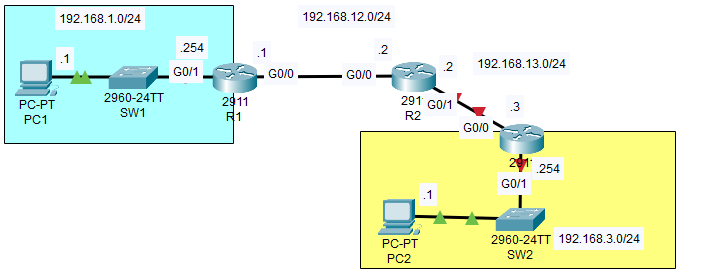

# 🖧 Lab de Enrutamiento Estático  

## 📖 Descripción  
Este laboratorio muestra cómo configurar enrutamiento estático en routers para conectar múltiples redes sin utilizar protocolos dinámicos.  

## 🖼️ Topología  
  
  

## ⚙️ Configuración  
Pasos para configurar el enrutamiento estático en Cisco IOS:  

1. **Configurar interfaces en los routers**  
```bash
Router(config)# interface GigabitEthernet0/0
Router(config-if)# ip address 192.168.1.1 255.255.255.0
Router(config-if)# no shutdown
